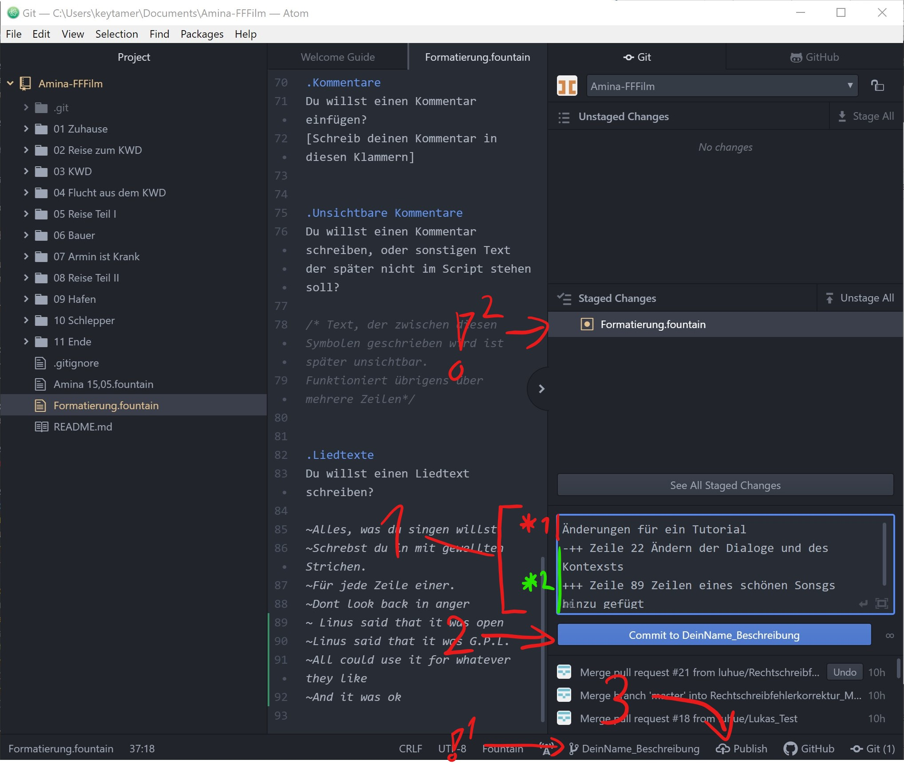
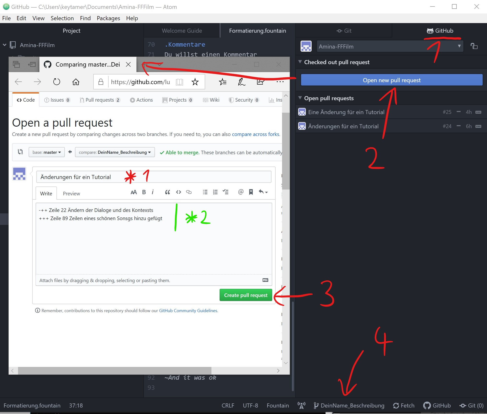

# Installation und Settup
# Installation und Setup

Bei Fragen Lukas oder Nelson fragen

## Software zu downloaden
Folgende Software muss installiert werden:
* https://git-scm.com/downloads Hilfe bie der Installation von GIT: Weindows( [1] ) MAC( [2] )
* https://atom.io


[1]: https://youtu.be/nbFwejIsHlY?t=28
[2]: https://youtu.be/sJ4zr0a4GAs?t=98


## Clonen(Download) des Reposetirys(Ortners)
### GIT Hub Login
Regstiert euch auf [Github](https://github.com)
Schickt E-Mail und euren Username an Luisa aus der Skript Gruppe

### Config GIT + Atom
#### Config in GIT Bash
Öffnet GIT Bash


GIT Bash (habt ihr euch unter [1.] installiert) öffnen. Git Bash ist ein Terminal Programm.


**:exclamation:Wichtig:**
:exclamation: Folgende Commands Zeile für Zeile (einzeln) kopieren (Rechte Maustaste drücken -> einfügen) und nach jeder Zeile Enter drücken (Bitte kurz warten, bis Git jede Zeile ausgeführt hat, erkennbar an "done")  :exclamation: :
```bash=cmd
apm install teletype
apm install fountain
apm install pdf-view
cd "My Documents"

```
```bash=git
git clone https://github.com/luhue/Amina-FFFilm.git
```

``` git config --global user.email "*"``` :exclamation::exclamation::exclamation: das * durch eure E-Mail ersetzen (die mit der ihr euch bei Github angemeldet habt )
```git config --global user.name "Your Name" ```:exclamation::exclamation::exclamation: Your Name durch euren Github Namen ersetzen
(die "" sind wichtig bei beiden Befehlen)

#### Config in Atom

Atom öffnen


Oder File (oben links) -> Projekt öffnen
----


----


----


----


----

##### ADD Branch


3. Eingeben und mit ```Enter``` bestätigen
----


Wird angezeigt wenn das Dokument noch nicht gespeichert wurde.
Speichern kann man in Atom mit ```Strg+S```

  ----


4. Einzelne Dateien können mit ```Enter``` zum Einarbeiten vorgeschlagen werden.

> :exclamation: Achte daruf das du in den Richtigen Branch speicherst.

----



1. *1 Kurze generelle Überschrift
1. *2 Beschreiung der Änderungen ````<drei +/- Zeichen> Zeile <Nummer der geänderten Zeile> <Kurze Beschreiung der Änderung> ````

> Beispiel für 1. *2 +++ (nur hinzugefügt) -++ (etwas gelöscht, mehr hinzugefügt) ... --- (nur gelöscht)

> :exclamation: ^1 Achte daruf das du in den Richtigen Branch speicherst.
>
>:exclamation: ^2 Die Datein in diesem Feld werden für das Drehbuch vorgeschlagen

----



4. Um eine ganz andere Änderung zu machen 

:tada: :tada: :tada:

[Jetzt noch kurz die README.md lesen.](README.md)
  ---
